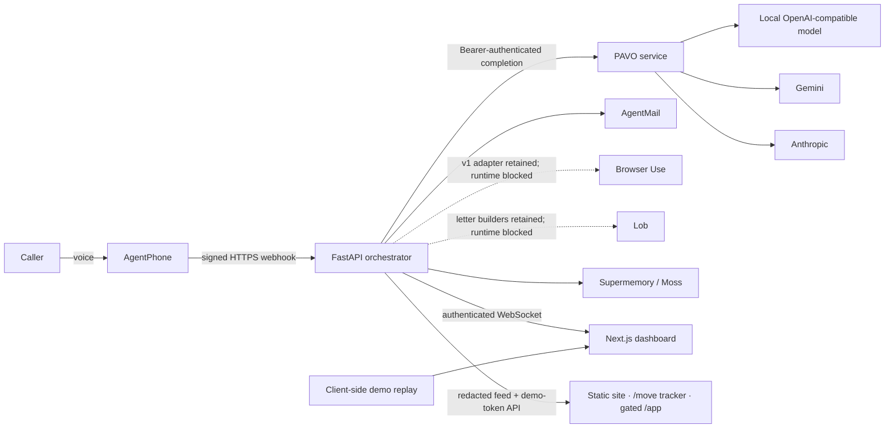
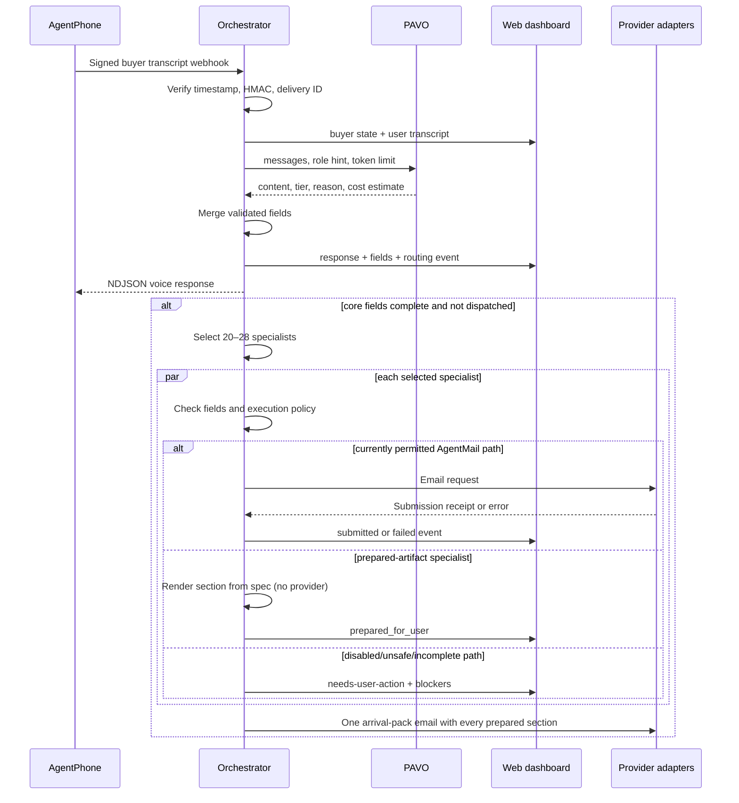
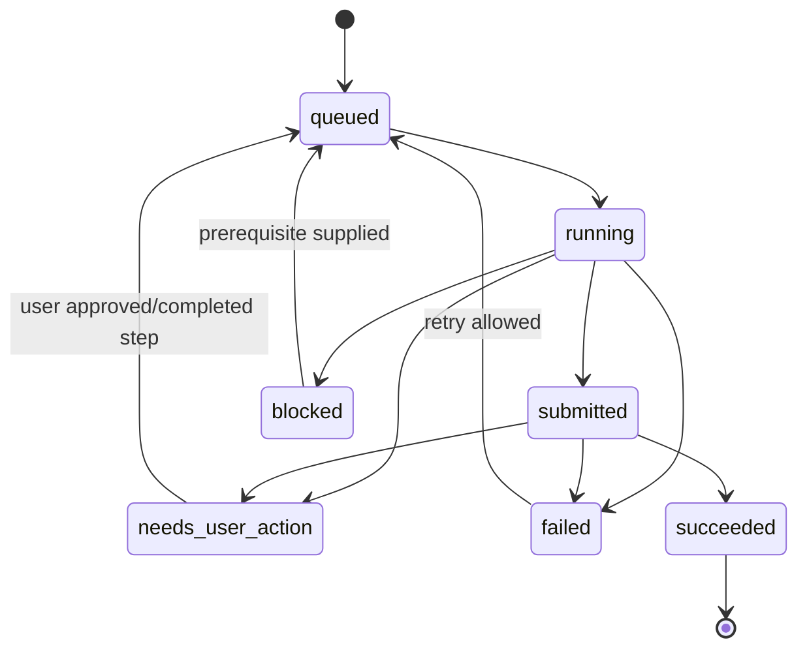
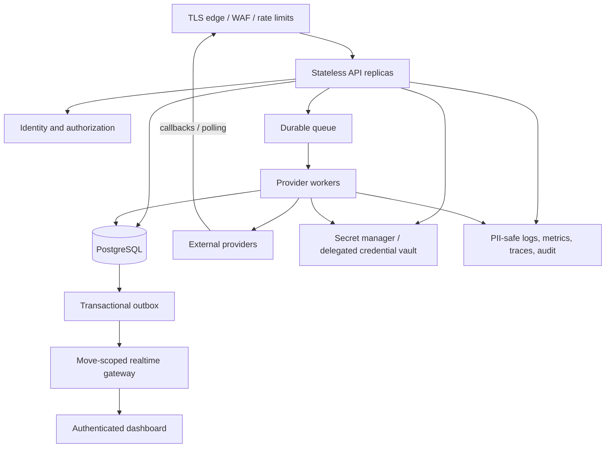

# Architecture

## System context

Relocate currently runs as three application components plus external
providers. The architecture is suitable for a local demonstration and for
iterating on the domain, but the orchestrator is a single-process stateful
service rather than a durable workflow engine.

Only the `buyer` persona is an inbound voice agent in the current roster.
The 28 specialists run as browser, email, postal-mail, or prepared-artifact
workflows from the orchestrator; they are not 28 concurrent voice calls.
Prepared-mode specialists call no provider at all — they render a section of
the arrival-pack email in-process.

## Component responsibilities

### Orchestrator

`orchestrator/app/main.py` owns the HTTP/WebSocket boundary and buyer call
lifecycle. Its responsibilities include:

- receiving AgentPhone webhook events;
- authenticating webhook delivery before parsing the payload;
- creating a buyer context and marketplace event;
- calling PAVO for the next buyer/specialist response;
- extracting and merging move fields;
- launching specialist fan-out when core fields are present;
- broadcasting state, transcript, routing, cost, and artifact events;
- triggering follow-up integrations at call/task completion.

`orchestrator/app/marketplace.py` selects specialists and invokes the
mode-specific adapters. Each specialist catches its own error so one failure
does not stop the rest of the wave. It also owns the two batch sends that
close a wave: the playbook digest for blocked specialists, and the
arrival-pack email carrying every prepared section.

`orchestrator/app/prepared.py` (with `prepared_sections.py` and
`personas_extra.py`) is the prepared-artifact path: a registry of
`agent_id → (title, body template)` rendered against the move spec by a
`string.Formatter` whose missing keys become explicit `<placeholders>`. There
is no model call and no provider call, so the only failure modes are a
missing registration (raised) and a blocked or unreceipted arrival-pack send
(logged; the event is not marked sent).

`orchestrator/app/demo_auth.py` gates the product surface at `/app`: a
constant-time check of one shared credential pair, then an HMAC-signed,
expiring bearer token keyed by `PUBLIC_REF_SECRET`. The static page never
holds the password, and the workspace's move list is filtered to
`origin_channel == "demo"`.

`orchestrator/app/state.py` is the current event store: an in-memory working
set mirrored to single-node SQLite (`persistence.py`). Restarts recover
events, buyer contexts, and webhook dedupe records; specialists that were in
flight during a crash resurface as `needs-user-action` with an explicit
restart blocker. The remaining limitation is scale-out: scheduled work is not
durable, and replicas do not share state or idempotency records.

### PAVO service

`pavo_server/route.py` makes a deterministic decision among `gemma-local`,
`gemini-flash`, and `claude-opus` using role, history depth, prior tier, and
keyword patterns. `pavo_server/app.py` validates requests, enforces a bearer
token, calls the chosen provider, and falls back among configured providers.

The code in this repository is a transparent heuristic router. It does not
load learned weights. Costs are estimates derived from operator-supplied price
configuration and provider usage metadata, not billing truth.

### Dashboard

The `web` application is a static-export-compatible Next.js client. It has two
data sources:

1. **Live mode:** an authenticated WebSocket receives orchestrator events and
   reduces them into dashboard state.
2. **Demo mode:** a client-side replay drives a deterministic visualization
   when live connectivity is unavailable.

Demo events are presentation data and must remain visibly labeled. A public
static build cannot safely contain a long-lived dashboard token; production
needs a server-issued, short-lived credential bound to an authenticated user
and move.

### Provider adapters

The orchestrator contains adapters for four external specialist substrates:

| Substrate | Current contract |
|---|---|
| Browser Use | Legacy v1 submit/poll builders retained; current specialist dispatch blocks them before invocation. |
| AgentMail | Send one or more messages and capture message identifiers. |
| Lob | Letter builders retained; current policy blocks purchase pending customer review/signature. |
| AgentPhone | Deliver inbound transcript/lifecycle webhooks and accept streamed replies. |

A fifth specialist mode, `prepared`, has no external substrate: it renders a
personalized section in-process, and the wave's sections leave as one
AgentMail arrival pack.

Supermemory and Moss provide optional memory/runbook context. Stripe and Sponge
are present as experimental sponsor adapters but are not a complete customer
payment or escrow subsystem.

## Live request sequence

The current `fan_out` work executes in the API process. Some follow-up work is
started with `asyncio.create_task`. Neither mechanism survives a process crash.

## State and lifecycle

The current single-node implementation has three in-memory structures:

- `BuyerCallContext`: one inbound call, collected fields, dispatch status, and
  follow-up status;
- `MarketplaceEvent`: one move and all selected specialist contexts;
- `SpecialistCallContext`: one task's state, transcript, artifact, blockers,
  and timestamps.

The data model now distinguishes blockers, provider submission, failure, and a
separate terminal outcome, and every mutation is mirrored to single-node
SQLite for restart recovery. It is not yet a versioned, multi-replica workflow
state machine. Production must keep workflow termination and
business success separate.

Recommended core states:

Every transition should record who/what caused it, an idempotency key, consent
or approval where relevant, and immutable evidence. `submitted` must not be
displayed as `succeeded` without final provider confirmation.

## Trust boundaries

| Boundary | Current control | Required hardening |
|---|---|---|
| AgentPhone → orchestrator | Per-agent secret, timestamp-bound HMAC, delivery ID, fail-closed lookup | Verify vendor signature contract, durable replay store, rate limit, secret rotation, payload-size limits |
| Dashboard → orchestrator | Dedicated token and CORS allowlist in current backend work | HTTPS identity session, move-scoped authorization, short-lived WebSocket ticket, origin enforcement |
| Orchestrator → PAVO | Bearer token; local/private HTTP is allowed | Private service network or TLS, rotation, rate limits, request redaction |
| Orchestrator → providers | Provider API keys from environment | Workload identity/secret manager, least privilege, egress controls, typed contracts, audit and reconciliation |
| Sensitive customer fields | Prompt rules avoid collecting some fields by voice | Authenticated encrypted intake, field policy, consent, retention/deletion, redacted logs, tenant isolation |
| Static dashboard | No server secret is required for replay | Never embed long-lived live credentials; strict CSP and artifact URL policy |
| `/app` → orchestrator | Shared workspace credential verified server-side; HMAC-signed expiring token; move list scoped to the workspace channel | Per-user accounts, move-scoped authorization, revocable server-side sessions |

## Failure behavior

- A specialist exception is captured and surfaced without stopping other
  specialists.
- Browser Use v1, Lob purchase, PCP, and pharmacy execution are policy-blocked
  before provider invocation and surface `needs-user-action`.
- Missing provider keys and provider errors remain visible; they are not
  converted into successful playbook artifacts.
- The PAVO service tries a deterministic chain of configured providers and
  returns an error if every provider fails; it does not fabricate a completion.
- Provider timeouts and failures exist, but retries and reconciliation are not
  yet backed by a durable job system.
- An orchestrator restart recovers persisted state; in-flight specialists are
  honestly marked `needs-user-action`, and in-flight webhook claims stay
  retryable. Multi-replica deployments remain unsupported.

## Target production architecture

This target separates synchronous request handling from long-running provider
work, makes side effects idempotent, and gives every customer-visible state a
durable source of truth. The ordered implementation plan is in
[STATUS.md](STATUS.md#ordered-plan-to-build-the-product).
