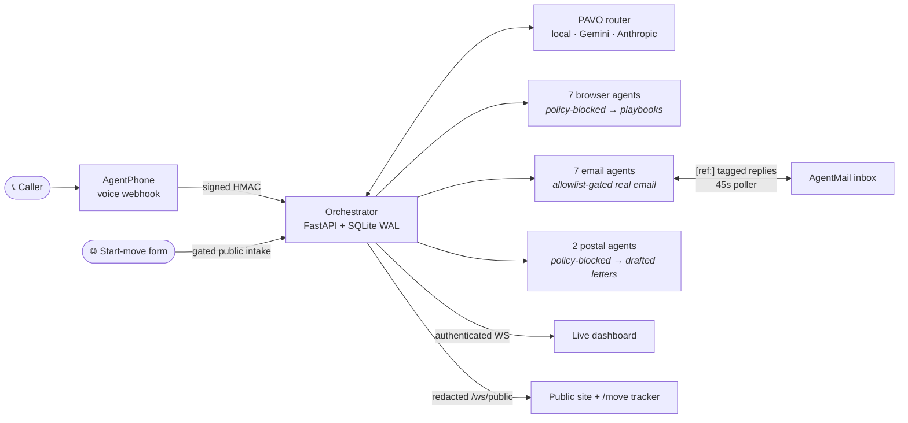

<div align="center">

# Relocate

**One phone call. A swarm of 17 AI agents coordinates your entire move.**

[](https://github.com/vnmoorthy/relocate-ai/actions/workflows/ci.yml)
[](https://github.com/vnmoorthy/relocate-ai/actions/workflows/deploy-pages.yml)
[](LICENSE)
[](orchestrator/pyproject.toml)
[](web/package.json)

[**Live site**](https://vnmoorthy.github.io/relocate-ai/) · [Architecture](ARCHITECTURE.md) · [Status](STATUS.md) · [Security](SECURITY.md) · [Demo runbook](DEMO_SCRIPT.md)


</div>

---

Call the concierge number for your deployment and a voice concierge
collects your move in about ninety seconds — origin, destination, date,
household. Or skip the phone: the website's **Start your move** form briefs
the same dispatcher. Either way the orchestrator fans out **16 specialist
agents in parallel**: the email-mode agents send real email (three mover
quote requests, a school pre-enrollment inquiry, a vet records request, a
bank call script, a personalized flight search), a 45-second poller ingests
the replies and threads them back onto your move, and every event streams to
a live dashboard plus a shareable per-move tracker page.

> **Voice line status:** the previously published demo number was released by the carrier, so no number is attached to the buyer agent right now and the site does not advertise one. The voice pipeline itself is unchanged — attach a number to the `move-buyer` agent in AgentPhone, set `PHONE_LIVE = true` in `web/src/app/page.tsx`, and `demo-line.sh` re-points the webhook on its next pass. Web intake is live and needs no number.

Whatever an agent cannot **verifiably** finish, it hands back to you — with
the exact artifact you need: a call script filled in with your details, a
cancellation letter ready to sign, an unsigned HIPAA release drafted as a
PDF. Never a fabricated success.

## Why this repo is different

Most agent demos report success when an API call returns. Relocate's core
discipline is the opposite — every agent lands in an honest terminal state:

| State | Meaning |
|---|---|
| `submitted` | A provider accepted a request — *not* proof the task completed |
| `needs-user-action` | A signature, credential, payment, or policy gate needs you |
| `failed` | The provider errored — shown, never relabeled |

That discipline is enforced in code, not copy:

- **Fail-safe execution policy.** Browser automation, certified-mail
  purchase, and medical/pharmacy transmission are policy-blocked at dispatch
  until secure consent and credential workflows exist — even with API keys
  configured.
- **Outbound allowlist, empty by default.** Every outgoing email recipient
  must be explicitly listed in `AGENTMAIL_ALLOWED_RECIPIENTS`; an empty list
  blocks every send. For demos, `AGENTMAIL_DEMO_RECIPIENT_OVERRIDE` reroutes
  all outbound mail to one operator-controlled inbox, labeled with the true
  intended recipient — real artifacts, zero unsolicited email.
- **Replies are recorded, never trusted.** Inbound email is correlated to a
  move by the `[ref:…]` subject tag, quote figures are extracted with
  deterministic regex (a number is either literally in the email or absent),
  and a reply never flips a specialist to "completed" — reading and deciding
  stays with you.
- **Anti-fabrication extraction guard.** The voice concierge merges only
  fields the caller actually said; an emission copying the prompt's example
  values is detected and dropped.
- **Signed webhooks, durable idempotency.** Timestamp-bound HMAC with replay
  protection; completed-delivery records persist across restarts, and an
  in-flight duplicate gets a 409, never a false acknowledgment.
- **A router you can read.** PAVO routes each turn across a local model
  (Ollama/Apple Silicon), Gemini, and Anthropic tiers with deterministic,
  auditable heuristics and configured fallback — the specific model behind
  each tier is configuration, not a hardcoded claim. If every provider
  fails, the request errors; it never invents a response.

## How it works



One concierge plus 16 specialists are defined in code; a real move dispatches
11–16 of them depending on pets, children, car, and visa status. The full
roster and conditional rules live in [AGENT_COUNT.md](AGENT_COUNT.md).

**The reply loop closes.** Every outbound subject carries
`[ref:event_id:agent_id]`. A background poller reads the AgentMail inbox
every 45 seconds, matches replies to their move, parses quote facts
(total / deposit / availability) deterministically, forwards the full reply
to the customer's own inbox (echo-guarded), threads it onto the specialist
that solicited it, and pushes a live update. Seen message ids live in a
SQLite mail ledger, so a restart never re-announces old replies.

**Blocked never means empty-handed.** Each user-blocked specialist prepares
a personalized playbook (16 deterministic templates — call scripts,
ready-to-sign letters, filing walkthroughs; no LLM, no invented facts), and
one digest email delivers them all when the wave settles. The three
signature-gated tasks go further: the customer receives the actual rendered
Comcast cancellation letter, the CA DMV DL-13A letter, and an
unsigned-draft HIPAA release PDF to review and sign — Relocate never signs
or submits on their behalf.

## Public product surfaces

The static site cannot hold a secret, so it never touches the authenticated
dashboard socket. It gets its own hardened surface instead:

| Surface | What it is |
|---|---|
| `POST /api/public/start-move` | Web intake for a real dispatch. Off by default (`ENABLE_PUBLIC_INTAKE`); honeypot field, per-IP and global rate limits, and a 10-minute idempotency window so a retry returns the original tracker instead of double-dispatching. Optional household fields (name, phone, child, pet, vet email) unblock the specialists that need them. |
| `WS /ws/public` | Unauthenticated live feed — a server-side redacted projection of dashboard events (states, tiers, costs; every free-text and identifier field blanked). Capacity-capped, replayed on subscribe, per-send timeouts. |
| `GET /api/public/move/{id}` | Redacted snapshot behind an unguessable move id: route, honest per-task states, playbook titles, reply domains/timestamps, extracted quote displays — never emails, bodies, transcripts, or PII. |
| `/move/#<id>` | The shareable tracker page, with live quote comparison as mover replies land. The post-call and post-dispatch emails link here. |

## Quick start

Prerequisites: Python 3.12 + [`uv`](https://docs.astral.sh/uv/), Node 22 +
[`pnpm`](https://pnpm.io/), and [Ollama](https://ollama.com/) with the model
named in `VLLM_MODEL` (default `gemma2:2b`) for the local tier.

```bash
git clone https://github.com/vnmoorthy/relocate-ai.git
cd relocate-ai

cp orchestrator/.env.example orchestrator/.env
# Replace every REPLACE_* placeholder (openssl rand -hex 32 per token).
# Leave provider keys blank — everything runs with honest blocked states.

cd orchestrator && uv sync --locked --all-groups && cd ..
cd web && pnpm install --frozen-lockfile && cd ..

ollama pull gemma2:2b
./run.sh
```

The launcher starts the PAVO router on `:8765`, the orchestrator on `:8000`,
and the dashboard on `:3000` — and prints an authenticated **Live view** URL
(the WebSocket token rides in a URL hash → sessionStorage → subprotocol offer;
it never appears in a query string or the client bundle). Without a live
backend the dashboard plays a deterministic simulation, stamped `SIMULATION`
the way SpaceX stamps its renders; the tag flips to `LIVE` when a real session
connects. Stop with `./run.sh stop`.

To run the always-on phone line, use the supervisor:

```bash
./demo-line.sh
```

It keeps the whole inbound chain alive — no Mac sleep, Ollama pinned warm,
the `run.sh` stack, a cloudflared quick tunnel — and re-points the AgentPhone
webhook whenever the tunnel URL rotates. The public site discovers the
backend through `web/public/live.json`, which the supervisor rewrites
locally; publishing it is a deliberate commit-and-push. This is honest
laptop-grade hosting for a developer preview; a named tunnel or a cloud host
is the production step ([STATUS.md](STATUS.md)).

Verify everything without touching a single external provider:

```bash
./verify-all-agents.sh
```

That runs ruff, mypy, and the full mocked test suite — roster consistency
across Python/TypeScript/docs, conditional dispatch, honest terminal states,
webhook security, the outbound allowlist, reply ingestion, playbook
rendering, persistence recovery, and the public-surface redaction rules. The
dashboard has its own `pnpm lint / typecheck / test / build`.

## What's real today

Relocate is an open-source relocation-orchestration product in **developer
preview** — a production lane shipped narrow, not a demo toy. Current
inventory:

- ✅ Inbound voice line with incremental field extraction, web intake,
  conditional fan-out, real allowlist-gated email dispatch, closed-loop
  reply ingestion with quote parsing, playbooks + rendered signature
  documents, durable single-node SQLite state with honest crash recovery,
  authenticated dashboard, redacted public feed and tracker, HMAC webhook
  security, CI, containers — built and tested.
- 🟡 Email submissions run only when their prerequisites *and* the recipient
  allowlist (or the demo override) are satisfied; anything else lands as an
  honest `needs-user-action` with a prepared playbook.
- ⛔ Browser automation, certified-mail purchase, and regulated
  medical/pharmacy transmission are deliberately blocked pending secure
  credential/consent workflows. The customer gets drafted documents and
  scripts instead of an unsafe attempt.
- ❌ Multi-replica state, a durable job queue, customer accounts, and secure
  PII intake are not built. State survives restarts on one node; it does not
  scale out yet.

The complete subsystem-by-subsystem inventory and the phased plan to
production live in [STATUS.md](STATUS.md) — kept current, audited against the
code.

## Repository map

```text
.
├── orchestrator/       FastAPI service · personas · playbooks · integrations · tests
├── pavo_server/        deterministic router + model-provider adapters
├── web/                Next.js site · dashboard · /move tracker · live WS client
├── deploy/             Dockerfiles + nginx static hosting
├── compose.yaml        local three-service scaffold
├── run.sh              local stack launcher (PAVO + orchestrator + dashboard)
├── demo-line.sh        always-on phone-line supervisor (tunnel + webhook repoint)
├── ARCHITECTURE.md     components, data flow, trust boundaries
├── STATUS.md           built / partial / missing — the capability contract
├── SECURITY.md         current controls, public-surface threat model, known gaps
└── DEMO_SCRIPT.md      honest demo narration rules
```

## Contributing

PRs welcome — start with [CONTRIBUTING.md](CONTRIBUTING.md). The one
non-negotiable: no fabricated success paths. Blocked is blocked, submitted is
not completed, and the test suite enforces both.

## License

[MIT](LICENSE). External datasets, model weights, services, and trademarks
retain their own terms — see [NOTICE.md](NOTICE.md).
