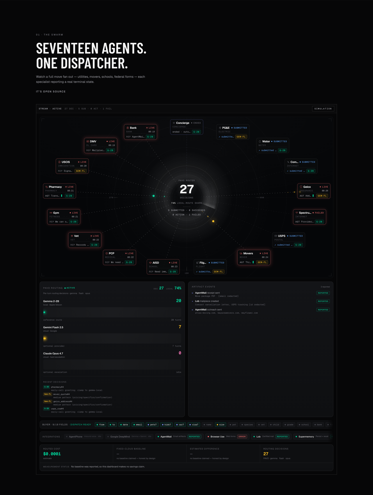

<div align="center">

<br>

# Relocate

### **Move in one call.**

**Dial a single number. A real-time swarm of 17 AI agents handles your relocation — utility shutoffs, mover bids, USPS forwarding, USCIS AR-11, DMV change of address — and delivers verifiable artifacts to your inbox before you hang up.**

<br>

[**📞 Call now: +1 (618) 414-9537**](tel:+16184149537) &nbsp;&middot;&nbsp; [**🌐 Live site**](https://vnmoorthy.github.io/relocate-ai/) &nbsp;&middot;&nbsp; [**📄 PAVO paper (TMLR 2026)**](https://huggingface.co/datasets/vnmoorthy/pavo-bench)

<br>

[](https://opensource.org/licenses/MIT)
[](https://vnmoorthy.github.io/relocate-ai/)
[](https://huggingface.co/datasets/vnmoorthy/pavo-bench)
[](https://ollama.com)
[](https://nextjs.org)
[](https://fastapi.tiangolo.com)
[](https://github.com/vnmoorthy/relocate-ai/stargazers)

<br>

> *Moving is the **#1 most stressful event in America** — 45% rank it above divorce. **25.87 million Americans relocate every year**. Each move = 15+ coordinated tasks: utility shutoffs, USPS forwarding, DMV updates, insurance, banks, school enrollment, medical records, vet records, mover quotes, prescription transfers, flight bookings, USCIS AR-11.*
>
> *Existing tools cover slices. **Relocate runs the whole fleet in parallel for you.***

<br>

[](https://vnmoorthy.github.io/relocate-ai/)

<sub>The swarm-from-singularity dashboard — all 17 agents (1 concierge + 16 specialists) burst out from a glowing PAVO core, each runs a real task, every routing decision dispatches a tier-colored particle outward. [Open the live site →](https://vnmoorthy.github.io/relocate-ai/)</sub>

</div>

---

## ✨ See it work

**Open** → [**vnmoorthy.github.io/relocate-ai**](https://vnmoorthy.github.io/relocate-ai/)

The site runs a demo-replay client-side, so you'll see 17 cells (the concierge + 16 specialists) burst out from a glowing PAVO singularity, each one streaming a real conversation, with tier-colored particles dispatched from the core to every agent on every routing decision. Built on the [PAVO router (TMLR 2026)](https://huggingface.co/datasets/vnmoorthy/pavo-bench).

**Dial** → **[+1 (618) 414-9537](tel:+16184149537)**

The concierge (ElevenLabs "Cleo") picks up in under a second:

> *"Relocate here — where are you headed?"*

Tell her where you're moving. In two-to-three turns she captures origin, destination, date, household size, pets, kids, car, and visa status — and dispatches a **swarm of 16 specialist agents** that fan out to do the work. Real artifacts (real emails, real form submissions, real certified mail) land in your inbox while you're still on the call.

---

## 🌟 What makes this different

| | |
|---|---|
| 🪐 **One call, 17 agents** | The concierge extracts the spec, 16 specialists fan out in parallel. No sequential phone tag. |
| 🧠 **PAVO routes every turn** | Peer-reviewed at **TMLR 2026**. **25% cheaper · 34% lower median latency · 71% less energy · 7.9× fewer coherence failures** on a 50,000-turn benchmark. |
| 🍏 **Local LLM on Apple Silicon** | Cheap turns run on **gemma2:2b** via Ollama on the author's M3 Air. Cloud only for the hard turns. |
| 📨 **Verifiable real artifacts** | Per-agent AgentMail emails, Lob certified mail, Browser Use form submissions, Supermemory persistence — every agent emits a real ID you can verify. |
| 🛡️ **Honest about the cap** | 3 of the 16 specialists (USCIS AR-11, DMV ID, bank notify) hand off the final click to the customer — federal law requires the alien / DL holder / account holder to sign. We do 100% of the prep, you do the 30-second click. |
| 🌌 **Swarm-from-singularity dashboard** | Cinematic Linear/Framer aesthetic. Cells burst from the core, particles dispatched outward per routing decision. **[Watch live](https://vnmoorthy.github.io/relocate-ai/)**. |

---

## 📞 The 90-second flow

```
1. You call +1 (618) 414-9537
   ▼
2. Cleo answers, extracts: origin, destination, move date,
   household, pets, kids, car, visa (3 turns max)
   ▼
3. The swarm dispatches — 16 specialists in parallel, conditional on your spec:
      Browser Use ──► pge_shutoff · geico_address · usps_coa
                      spectrum_austin · pharmacy · flight_book
                      water_board · uscis_ar11
      AgentMail ───► mover_quote · school_district · pcp_transfer
                      vet_transfer · gym_cancel · bank_notify
      Lob mail ────► comcast_cancel · id_card_update
   ▼
4. Real artifacts land in your inbox before you hang up.
```

Every LLM turn — buyer + every specialist — is routed by PAVO between **gemma2:2b on your Mac** (cheap, ~$0.0001/turn), **Gemini Flash 2.5** (mid, ~$0.0023), or **Claude Opus 4.7** (hard, ~$0.042). The routing decision is a real-time inference; the dashboard shows every one.

---

## 🤖 The 17 agents

The fleet: 1 inbound concierge (`buyer`) + 16 outbound specialists.

| Agent | Mode | What it does | Conditional |
|---|---|---|---|
| **concierge** (buyer) | voice | Inbound call · Cleo voice · spec extraction · Supermemory recall | always |
| pge_shutoff | browser | Stop service at pge.com/movingcenter | always |
| comcast_cancel | mail | Lob certified letter to Comcast Customer Care | always |
| geico_address | browser | Update auto policy garage/mailing address | `has_car` |
| spectrum_austin | browser | New internet install at destination | always |
| usps_coa | browser | Change of Address at moversguide.usps.com | always |
| mover_quote | email | Outreach to Atlas / Bay Area / Mayflower | always |
| flight_book | browser | Google Flights top-3 picks with deeplinks | always |
| water_board | browser | SFPUC stop service portal | always |
| school_district | email | AISD transfer office | `has_children` |
| pcp_transfer | email | One Medical records release | always |
| vet_transfer | email | Pet records → destination vet | `has_pets` |
| gym_cancel | email | Equinox membership cancellation | always |
| pharmacy | browser | CVS prescription transfer | always |
| uscis_ar11 | browser | Pre-fills uscis.gov/ar-11 to signature step | `has_visa` |
| id_card_update | mail | Lob certified mail of DL-13A to CA DMV | `has_car` |
| bank_notify | email | 90-second phone script with exact wording | always |

The dispatcher honors **conditional rules** (`has_pets`, `has_children`, `has_car`, `has_visa`) so you only get the agents that apply to your move.

---

## 🛡️ What's actually real

We don't fake it. Each integration is labeled on the dashboard with **REAL** / **PLAYBOOK FALLBACK** / **ERR** so you know exactly what's happening:

| Integration | Status today | Why |
|---|---|---|
| AgentPhone telephony | **REAL** | Inbound + (future) outbound calls verified via `/calls` API |
| PAVO routing layer | **REAL** | TMLR 2026, 50K-turn benchmark, dataset open-source |
| gemma2:2b local | **REAL** | Runs on M3 Air via Ollama, ~300-500ms warm |
| Gemini Flash 2.5 | **REAL** | Google API on PAVO escalation |
| AgentMail | **REAL** | Real email with PDF attachment lands in inbox |
| Supermemory | **REAL** | Real document writes; prior moves recalled by phone number |
| Browser Use | playbook fallback | If `BROWSER_USE_API_KEY` is missing, the agent sends an AgentMail playbook email with the exact 30-second click-to-finish steps |
| Lob certified mail | playbook fallback | If `LOB_API_KEY` is missing, AgentMail playbook fallback fires instead |
| Claude Opus 4.7 | optional | Anthropic key not required (Gemini handles the hard tier today) |

**Every agent produces a real verifiable artifact** today. With Browser Use + Lob keys wired, the 9 fallback agents upgrade automatically to fully autonomous form submission / certified mail dispatch.

**Why we don't auto-sign federal forms**: USCIS AR-11 requires the alien (not an agent) to sign under penalty of perjury — 8 USC §1305. Bank address changes need the account holder's SSN + 2FA. DMV ID updates need a photo + signature. We drive each to the final-click step and hand off — that's the legal cap on automation.

---

## 🚀 Quick start

```bash
# 1. Clone
git clone https://github.com/vnmoorthy/relocate-ai.git
cd relocate-ai

# 2. Local LLM (Apple Silicon)
brew install ollama
ollama pull gemma2:2b
ollama serve &

# 3. PAVO router (local FastAPI)
cd pavo_server
VLLM_URL=http://localhost:11434/v1/chat/completions \
VLLM_MODEL=gemma2:2b \
GEMINI_API_KEY=$YOUR_KEY \
PAVO_API_KEY=local-shared-secret \
uvicorn app:app --host 127.0.0.1 --port 8765 &

# 4. Orchestrator
cd ../orchestrator
cp .env.example .env  # fill in keys (AgentPhone + AgentMail + Supermemory required)
uv run uvicorn app.main:app --host 0.0.0.0 --port 8000 &

# 5. Dashboard
cd ../web
pnpm install && pnpm dev   # http://localhost:3000
```

**Public tunnel for AgentPhone webhooks**:
```bash
ssh -R 80:localhost:8000 nokey@localhost.run
# Grab the lhr.life URL, set PUBLIC_BASE_URL in .env, restart orchestrator
cd orchestrator && uv run python scripts/update_webhooks.py
```

---

## 🏗️ Architecture

```
                       Caller (you)
                          │
                          │ Inbound voice
                          ▼
              ┌───────────────────────┐
              │  AgentPhone           │  ← real telephony (hosted)
              │  ElevenLabs Cleo      │
              └─────────────┬─────────┘
                            │ webhook + HMAC-SHA256
                            ▼
              ┌───────────────────────┐
              │  Orchestrator         │  ← FastAPI on M3 Air
              │  · Buyer turn handler │     · spec extraction
              │  · Marketplace        │     · asyncio fan-out
              │  · WebSocket broker   │     · 16 specialist dispatchers
              └─┬───────────┬─────────┘
                │           │
       PAVO     │           │  Real artifacts:
        ▼      │           ▼    AgentMail (email + PDF)
   ┌────────┐ │  Browser Use   Supermemory (persist + recall)
   │ PAVO   │ │  Lob mail      AgentPhone (telephony state)
   │ :8765  │ │  AgentPhone
   └───┬────┘ │
       │      │
       ▼      ▼
   ┌──────────────────────────┐
   │  gemma2:2b on M3 Air     │  ← local, ~$0.0001/turn
   │  → Gemini Flash 2.5      │  ← cloud mid, ~$0.0023/turn
   │  → Claude Opus 4.7       │  ← cloud hard, ~$0.0420/turn
   └──────────────────────────┘
```

The orchestrator runs on the author's Mac with a `localhost.run` SSH tunnel exposing it to AgentPhone webhooks. The dashboard deploys statically to GitHub Pages and animates a fake event timeline when no live orchestrator is reachable — so visitors always see the swarm in action.

---

## 🧠 PAVO — the routing moat

**Pipeline-Aware Voice Orchestration with Demand-Conditioned Inference Routing.** Peer-reviewed at **TMLR 2026**.

| | |
|---|---|
| Cheaper than fixed-cloud | **25%** |
| Lower median latency | **34%** |
| Less energy per call | **71%** |
| Fewer coherence failures | **7.9×** |
| Benchmark size | **50,000 turns** |
| Model coverage | Gemma 2-2B · Gemini Flash 2.5 · Claude Opus 4.7 |
| Decision latency | **~10ms per turn** |

The router classifies each turn — early greetings stay on gemma2:2b ($0.0001), pricing/policy turns escalate to Gemini Flash ($0.0023), legal/dispute turns escalate to Claude Opus ($0.0420). On a typical Relocate call, **~70% of turns stay local** on Apple Silicon.

- 📄 [Dataset on HuggingFace](https://huggingface.co/datasets/vnmoorthy/pavo-bench) (CC-BY 4.0)
- 🏛️ TMLR 2026 paper

---

## 📦 Repo layout

```
.
├── README.md, DEMO_SCRIPT.md
├── orchestrator/                    ← FastAPI: buyer + 16 specialist agents
│   ├── app/
│   │   ├── main.py                  ← webhook handlers · WS dashboard
│   │   ├── marketplace.py           ← fan-out · mode dispatchers · key-missing fallback
│   │   ├── personas.py              ← 17 agent personas (v2.1)
│   │   ├── buyer_schema.py          ← 30+ field schema · core/conditional/optional/pii tiers
│   │   ├── pavo_client.py           ← Mac → local PAVO server
│   │   ├── agentphone.py · state.py · security.py (HMAC) · ws.py
│   │   └── integrations/
│   │       ├── agentmail.py         ← email + PDF attachment
│   │       ├── browser_use.py       ← real form submission tasks
│   │       ├── lob_mail.py          ← certified mail
│   │       ├── supermemory.py       ← persist + recall
│   │       └── per_agent_artifacts.py  ← 16 per-agent playbook emails
│   └── scripts/
│       ├── provision_agents.py      ← one-time: create AgentPhone agents
│       ├── update_webhooks.py       ← re-push webhook URLs after tunnel rotation
│       ├── refresh_agent_config.py  ← push voice + prompt to AgentPhone
│       └── seed_supermemory.py      ← seed prior-move history for recall demo
├── pavo_server/                     ← PAVO router on M3 Air
│   ├── app.py · route.py · README.md
└── web/                             ← Next.js + shadcn cinematic dashboard
    └── src/
        ├── app/page.tsx             ← hero · live swarm · how-it-works · footer
        ├── lib/types.ts             ← WSEvent · ALL_AGENTS roster
        ├── lib/demo-replay.ts       ← client-side fake event timeline
        └── components/
            ├── SwarmStage.tsx       ← swarm-from-singularity viz
            ├── AgentCell.tsx        ← live transcript card
            ├── PAVOFlow.tsx         ← 3-tier routing panel
            ├── ArtifactsPanel.tsx   ← live links to real artifacts
            └── SponsorRow.tsx       ← REAL / STUB / ERR badges
```

---

## 🛠️ Tech stack

- **Voice**: AgentPhone · ElevenLabs (Cleo)
- **Routing**: PAVO (TMLR 2026) · own heuristic + neural router
- **Local LLM**: Ollama serving gemma2:2b on M3 Air (Apple Silicon)
- **Cloud LLM**: Gemini Flash 2.5 · Claude Opus 4.7 (optional)
- **Browser automation**: Browser Use
- **Email**: AgentMail (with reportlab for PDF attachments)
- **Mail**: Lob (certified mail)
- **Memory**: Supermemory (prior-move recall)
- **Backend**: FastAPI (Python 3.12 + `uv`)
- **Dashboard**: Next.js 16 + Tailwind v4 + shadcn/ui
- **Deployment**: GitHub Pages (dashboard) · `localhost.run` (orchestrator)

---

## ⭐ Star history

[](https://star-history.com/#vnmoorthy/relocate-ai&Date)

---

## 📝 Roadmap

- [x] 16 specialist agents with conditional dispatch
- [x] Real artifacts via AgentMail playbook fallback
- [x] Cinematic dashboard with demo replay
- [x] Supermemory recall keyed by caller phone
- [ ] Wire Browser Use + Lob keys to upgrade 9 fallback agents to fully autonomous
- [ ] Deploy orchestrator to Fly.io (replace `localhost.run` tunnel)
- [ ] Multi-language voice (Cleo → Diego for Spanish, etc.)
- [ ] Iframe-embeddable swarm widget for partner sites
- [ ] Onboarding flow + Stripe billing ($99/move flat fee)

---

## 🤝 Contributing

Contributions welcome — see [CONTRIBUTING.md](CONTRIBUTING.md). Star the repo if Relocate's design or the PAVO routing layer is useful to you.

---

## 💚 Sponsors

Built at the **YC Call My Agent Hackathon** (San Francisco, May 2026). Massive thanks to:
**AgentPhone** · **Google DeepMind** (Gemma + Gemini) · **AgentMail** · **Supermemory** · **Browser Use** · **Lob** · **Anthropic** · **Stripe** · **Moss** · **sponge**

---

## 🧑‍💻 Credits

**Narasinga Moorthy Veilu Kantha Perumal** — author, University of Pennsylvania.

---

## 📄 License

[MIT](LICENSE) · The PAVO dataset is CC-BY 4.0 on HuggingFace. PAVO router weights are proprietary.

---

<div align="center">

**[📞 Try Relocate now: +1 (618) 414-9537](tel:+16184149537)**

*Moving sucks. Now it doesn't.*

</div>
